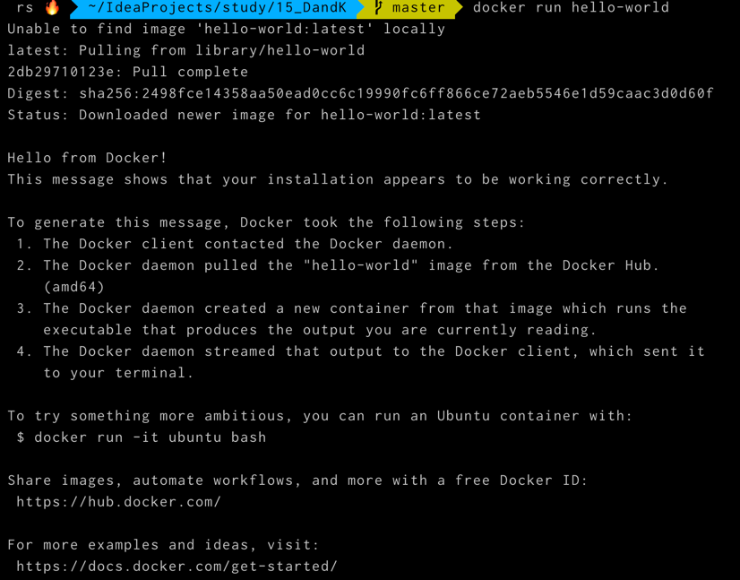
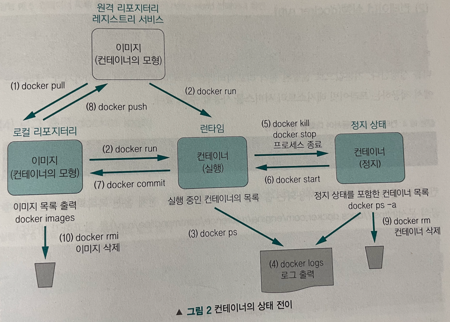
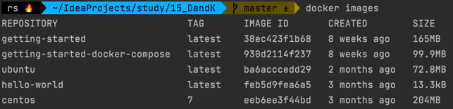
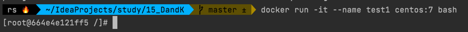

## 01.1 Hello-world 실행
```
$ docker run hello-world
```
  

내 저장소에 없다면 외부에서 이미지를 가져온다.

## 01.2 컨테이너의 생명 주기와 도커 커맨드


### 이미지 다운로드 (docker pull)
```docker pull 이미지명[:태그]```  
예시  
```$ docker pull centos:7```

  

### 컨테이너 실행 (docker run)
```$ docker run -it --name test1 centos:7 bash```



### 컨테이너의 상태 출력 (docker ps)
```$ docker ps -a```

### 로그 출력 (docker logs)
```$ docker logs [옵션] 컨테이너ID```  
* -f 옵션으로 실시간으로 발생하는 로그를 볼 수 있음

### 컨테이너 정지 (docker stop, docker kill)
```$ docker stop 컨테이너ID```
```$ docker kill 컨테이너ID```
* docker kill은 docker stop 을 사용할 수 없는 비정상적인 상황에서만 사용할 것!

### 컨테이너 재기동 (docker start)
```$ docker start [옵션] 컨테이너ID```
- -i 옵션을 통해 표준 출력, 표준 에러를 터미널에 표시하도록 할 수 있다.

### 컨테이너의 변경 사항을 리포지터리에 저장 (docker commit)
```$ docker commit [옵션] 컨테이너ID 리포지터리명[:태그]```  
- docker images 를 하면 생성된 것을 확인할 수 있다.

### 이미지를 원격 리포지터리에 보관 (docker push)

1. 도커허브에 가입하여 도커 ID를 획득한다.
2. docker login 으로 도커 ID와 pw를 입력하여 로그인한다. (한번만 로그인하면 된다.)
3. docker tag 로 로컬의 이미지에 태그를 부여한다.
4. docker push 를 사용하여 이미지를 원격에 업로드 한다.  

```$ docker push 원격_리포지터리명:태그```

### 종료한 컨테이너 제거 (docker rm)
```$ docker rm 컨테이너ID```

### 필요 없어진 이미지를 로컬 리포지터리에서 삭제 (docker rmi)
```$ docker rmi 이미지ID```